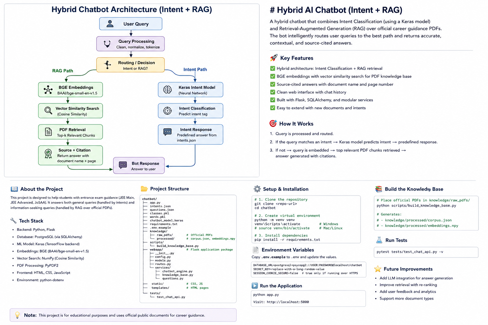

# Hybrid AI Chatbot — Intent + RAG

A hybrid AI chatbot that combines **Intent Classification** with **Retrieval-Augmented Generation (RAG)** to provide career-guidance information from official public documents.

The system routes each user query to the appropriate path: predefined intent responses for known conversational queries, or a RAG pipeline for information-seeking questions that require retrieval from the approved PDF knowledge base.

---

## 🚀 Key Features

- **Hybrid Intent + RAG architecture**
- Intelligent **query routing / decision making**
- **Keras neural network** for intent classification
- **BGE embeddings** using `BAAI/bge-small-en-v1.5`
- Vector similarity search using cosine similarity
- Retrieval from official JEE Main, JEE Advanced and JoSAA documents
- **Source-aware responses** with document and page citations
- PDF-based knowledge base
- Modular Flask backend
- PostgreSQL database integration through SQLAlchemy
- User authentication and chat history
- Automated knowledge-base generation
- API testing with Pytest
- Environment-based configuration for secrets

---

## 🏗️ Architecture

The chatbot follows a hybrid architecture where the query is processed and routed to either the **Intent path** or the **RAG path**.



### High-Level Flow

```text
                         User Query
                             │
                             ▼
                    Query Processing
                             │
                             ▼
                    Routing / Decision
                       ╱           ╲
                      ╱             ╲
                 RAG Path        Intent Path
                    │                 │
                    ▼                 ▼
             BGE Embeddings      Keras Model
                    │                 │
                    ▼                 ▼
            PDF Retrieval       Intent Response
                    │
                    ▼
              Source + Citation
                    │
                    ▼
                Bot Response
```

---

## 🧠 How It Works

### 1. Query Processing

The user submits a question through the chatbot interface.

The query is cleaned and processed before being passed to the routing layer.

### 2. Routing / Decision

The system determines whether the query is better handled by:

- **Intent Classification**, for predefined conversational or supported queries.
- **RAG Retrieval**, for information that needs to be retrieved from the document knowledge base.

### 3. Intent Path

For intent-based queries:

```text
User Query
    ↓
Keras Model
    ↓
Intent Classification
    ↓
Intent Response
```

The Keras model predicts the intent class using the trained vocabulary and class mappings.

The corresponding response is then returned from the predefined intent/question data.

### 4. RAG Path

For information-seeking queries:

```text
User Query
    ↓
BGE Embedding
    ↓
Vector Similarity Search
    ↓
Relevant PDF Chunks
    ↓
Source + Citation
```

The query is converted into an embedding using:

```text
BAAI/bge-small-en-v1.5
```

The resulting vector is compared against the pre-computed document embeddings using cosine similarity.

The most relevant chunks are retrieved from the knowledge base and used to produce a source-aware response.

### 5. Source and Citation

The RAG pipeline keeps track of the source document and page information associated with retrieved content.

This allows responses to reference the underlying document rather than providing unsupported information.

---

## 📚 Knowledge Base

The current knowledge base is built from official public documents related to engineering admissions and counselling.

Current sources include:

- JEE Advanced 2026 Information Brochure
- JEE Main 2026 Information Bulletin
- JoSAA 2026 Business Rules
- JoSAA 2026 FAQ
- JoSAA 2026 Schedule

The knowledge-building pipeline processes the PDFs into searchable chunks and generates embeddings for retrieval.

### Knowledge Base Generation

Place the approved PDF documents inside:

```text
knowledge/raw_pdfs/
```

Then run:

```bash
python scripts/build_knowledge_base.py
```

This generates:

```text
knowledge/processed/
├── corpus.json
└── embeddings.npy
```

---

## 🛠️ Tech Stack

| Component | Technology |
|---|---|
| Backend | Python, Flask |
| Intent Model | TensorFlow / Keras |
| Embeddings | BGE (`BAAI/bge-small-en-v1.5`) |
| Vector Search | NumPy / Cosine Similarity |
| Document Processing | PyPDF |
| Database | PostgreSQL |
| ORM | SQLAlchemy |
| Frontend | HTML, CSS, JavaScript |
| Testing | Pytest |
| Configuration | python-dotenv |

---

## 📁 Project Structure

```text
chatbot/
│
├── app.py
├── intents.json
├── intentsold.json
├── questions.json
├── classes.pkl
├── words.pkl
├── chatbot_model.keras
├── requirements.txt
├── .env.example
├── .gitignore
├── PHASE1.md
│
├── knowledge/
│   ├── raw_pdfs/
│   │   └── official PDF documents
│   │
│   └── processed/
│       ├── corpus.json
│       └── embeddings.npy
│
├── scripts/
│   └── build_knowledge_base.py
│
├── webapp/
│   ├── __init__.py
│   ├── config.py
│   ├── extensions.py
│   ├── models.py
│   ├── routes.py
│   │
│   └── services/
│       ├── __init__.py
│       ├── chatbot_engine.py
│       ├── knowledge_base.py
│       └── questions.py
│
├── static/
│   ├── style.css
│   ├── login.css
│   ├── signup.css
│   └── script.js
│
├── templates/
│   ├── index.html
│   ├── login.html
│   └── signup.html
│
└── tests/
    └── test_chat_api.py
```

---

## ⚙️ Setup & Installation

### 1. Clone the repository

```bash
git clone <repository-url>
cd chatbot
```

### 2. Create a virtual environment

#### Windows

```bash
python -m venv venv
venv\Scripts\activate
```

#### Linux / macOS

```bash
python3 -m venv venv
source venv/bin/activate
```

### 3. Install dependencies

```bash
pip install -r requirements.txt
```

### 4. Configure environment variables

Copy:

```text
.env.example
```

to:

```text
.env
```

Then provide your **local** configuration values.

> Never commit `.env` to the repository. It may contain database credentials, secret keys, or other sensitive configuration.

---

## ▶️ Running the Application

Start the Flask application:

```bash
python app.py
```

Then open:

```text
http://localhost:5000
```

---

## 🧪 Testing

Run the API tests using:

```bash
pytest tests/test_chat_api.py -v
```

The tests verify the chatbot API and its expected application behaviour.

---

## 🔄 Updating the Knowledge Base

When new approved documents need to be added:

1. Place the PDFs inside:

```text
knowledge/raw_pdfs/
```

2. Run:

```bash
python scripts/build_knowledge_base.py
```

3. The processed corpus and embeddings will be regenerated.

4. Restart the application.

This makes it possible to extend the chatbot's knowledge without changing the core retrieval implementation.

---

## 🔐 Security

Sensitive configuration is kept outside the repository.

The project uses:

```text
.env
```

for local secrets and configuration.

Only:

```text
.env.example
```

is included in the repository, containing placeholder values.

Do not commit:

- Database passwords
- API keys
- Secret keys
- Production credentials
- Private user data

---

## 🎯 Project Goals

The project was developed to explore how a traditional chatbot can be extended into a more capable AI-assisted system.

The main goals are:

- Combine traditional **intent classification** with modern **retrieval-based AI**
- Improve answers to information-heavy queries using document retrieval
- Ground answers in approved source documents
- Provide citations for retrieved information
- Keep the system modular and extensible
- Build a practical AI project suitable for real-world engineering workflows

---

## 🔮 Future Improvements

Possible future improvements include:

- Add an LLM generation layer on top of retrieved context
- Improve routing using semantic classification
- Add a re-ranking stage after initial retrieval
- Add retrieval evaluation metrics
- Improve citation precision
- Add conversation-aware retrieval
- Support additional document types
- Add monitoring and logging
- Improve automated evaluation and testing
- Deploy the application as a production service

---

## 📌 Current Architecture

The current implementation is intentionally a **hybrid system**:

```text
                    ┌─────────────────┐
                    │   User Query    │
                    └────────┬────────┘
                             │
                             ▼
                    ┌─────────────────┐
                    │ Query Processing │
                    └────────┬────────┘
                             │
                             ▼
                    ┌─────────────────┐
                    │ Routing /       │
                    │ Decision        │
                    └───────┬─┬───────┘
                            │ │
                  RAG Path  │ │  Intent Path
                            │ │
                    ┌───────┘ └───────┐
                    ▼                 ▼
             ┌─────────────┐   ┌─────────────┐
             │ BGE         │   │ Keras       │
             │ Embeddings  │   │ Model       │
             └──────┬──────┘   └──────┬──────┘
                    │                 │
                    ▼                 ▼
             ┌─────────────┐   ┌─────────────┐
             │ PDF         │   │ Intent      │
             │ Retrieval   │   │ Response    │
             └──────┬──────┘   └──────┬──────┘
                    │                 │
                    ▼                 │
             ┌─────────────┐          │
             │ Source +    │          │
             │ Citation    │          │
             └──────┬──────┘          │
                    │                 │
                    └────────┬────────┘
                             ▼
                    ┌─────────────────┐
                    │  Bot Response   │
                    └─────────────────┘
```

---

## 📄 Disclaimer

This project is intended for educational and experimental purposes. The knowledge base uses publicly available official documents for engineering admission and career-guidance information.

For actual admission decisions, users should verify important information against the latest official sources.
